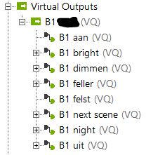
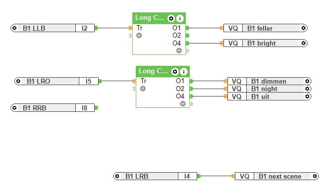

# LightAPI

This little API is the gateway for controlling lights, with Loxone on the control side, and Hue lights as the peripherals.

## Use case

Loxone is in the basis a PLC system, and only supports PicoC for programming. Controlling the Hue lights through a PicoC script and Loxone's Lightning modules felt very cumbersome. It would always end up out of sync, as adjustments to the lights are made through both Loxone's system, and the Hue app. Especially keeping Loxone up-to-date with the Hue app is quite problematic.

As an intermediate solution, I now use this LightAPI to control the lights through Loxone's virtual output commands. The API does not solve the feedback from the Hue lights to Loxone, but I can now make Loxone agnostic to the whole state of the Hue bridge. And since we hardly use the Loxone app anyway (but only physical buttons connected to digital inputs), this is working out great.

## How to use the LightAPI

- Build the local context with the `docker compose` files
- Collect a Hue API key, and store it as an environment variable: `hue_key`
- Collect Tradfri identity and API key, and store them as an environment variables: `tradfri_identity` and `tradfri_key`
- Deploy the image as a container, and make sure that you use the environment variable, and use the restart option
- Create virtual outputs in Loxone
  
  - For the virtual output add the ip address of the LightAPI as address
  - For each virtual output command, set `Command for ON` with one of the API endpoints, e.g. `room/7c7841b3-10b4-4dea-ada2-xxxxxxxxx/active/on` and select the proper method `GET` or `POST`
- Use the virtual outputs directly, or with a Long Click function block

## Disclaimer

This is a little tool I've written specifically for my situation. YMMV